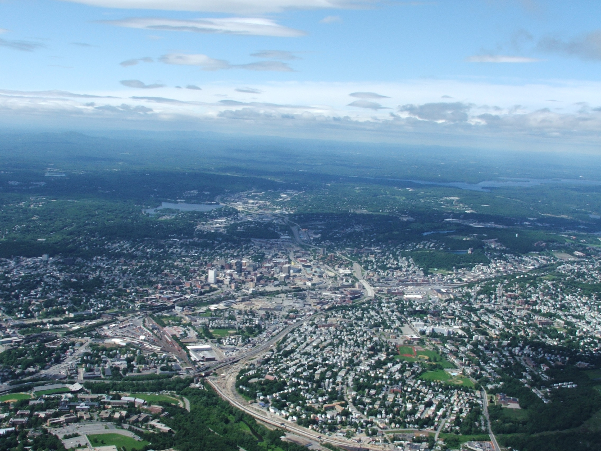

# Resources for entrepreneurs in Worcester!

Startup the Woo is a website to curate resources for entrepreneurs in Worcester.
We are community maintained and appreciate contributions on GitHub

<a href="https://commons.wikimedia.org/wiki/File:Worcester_Massachusetts.jpg#/media/File:Worcester_Massachusetts.jpg">Worcester Massachusetts</a> by <a href="//en.wikipedia.org/wiki/User:Viking1943" class="extiw" title="en:User:Viking1943">N. Wayne Hansen</a>. Licensed under <a title="Creative Commons Attribution-Share Alike 3.0" href="http://creativecommons.org/licenses/by-sa/3.0/">CC BY-SA 3.0</a> via <a href="https://commons.wikimedia.org/wiki/">Wikimedia Commons</a>.
