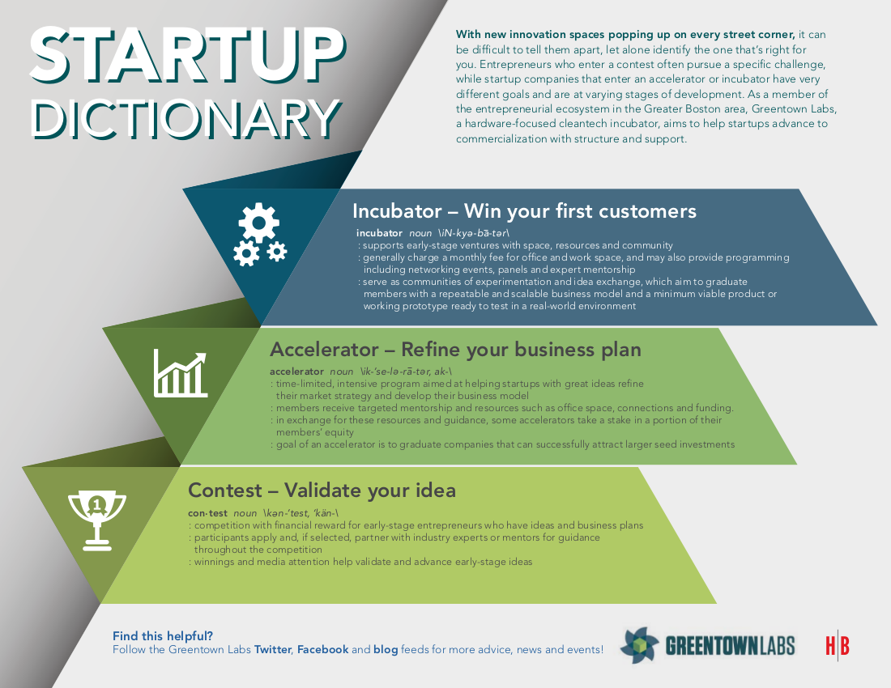

### Contest/Accelerator/Incubator

This great infographic from our friends at [Greentown Labs](http://greentownlabs.org) sums it up:

### [MVP](https://en.wikipedia.org/wiki/Minimum_viable_product)

A Minimum Viable Product. Teams develop these to guage customer interest
and sort out implementation challenges and costs.

